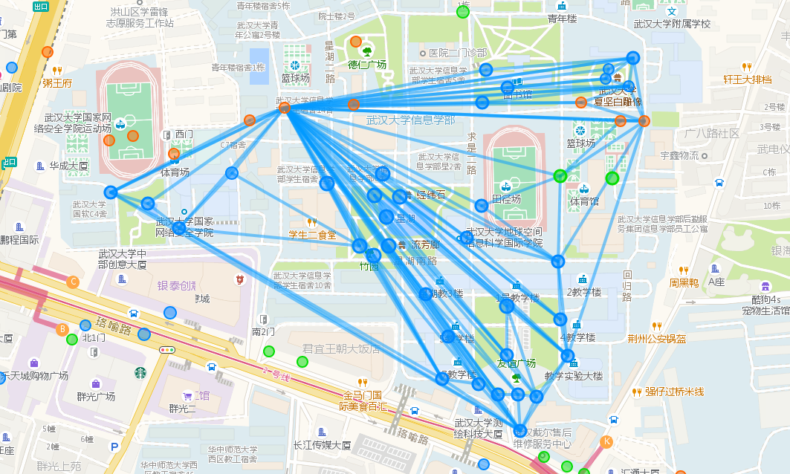

## requisite

python3

## 用法

使用本工具你需要知道如何从 IITC 中导出 portal 书签 (bookmark)，导入图形 (draw items)，以及做 ingress 多重最大ap时的连接顺序。不知道？点击 [IITC 教程](https://bjres.net/2018/02/02/iitc-%EF%BC%88ingress-intel-total-conversion%EF%BC%89%E6%95%99%E7%A8%8B/) 、[最大ap原理](https://zhuanlan.zhihu.com/p/19579305).

1. 在IITC中把所有要用到的点存为书签，将多重顶点放到第一位，导出存为文本文件，并与程序放入同一文件夹。

2. 打开命令行界面并切换到程序目录，输入 ```python getlink <文件名>``` 可获得图形文件。

3. 将图形文件中的内容导入IITC，最终效果如图。



其他用法请参考 ```python getlink -h```

### 进阶提示

portal在书签中的顺序会显著影响最终的图形，因为在下文“分割三角形”中，寻找分割点时是始终按照书签中portal的顺序遍历的。如果对某一部分的图形不满意，不妨调整一下这一部分的portal在书签中的位置。

## 程序原理

### 1. 获取凸包 

以x座标最大的portal为种子，记为A，在portal列表中寻找B，使得其余所有点都在向量AB左边；重复上一过程直到闭合。

### 2. 分割凸包

分割凸包为多个三角形，使得包含多重点的三角形内有最多的portal。

### 3. 分割三角形

分割三角形：以三角形内的一点为分割点，向三角形三个顶点连线将之分割成三个三角形。


当三角形内包含多重点时，优先从多重点分割，并以之为上顶点，其余两个点为下顶点。
当多重点为三角形的上顶点时，在三角形内的点中寻找一点S使其与两个下顶点连成的三角形中没有其他的点，以点S分割三角形，一直分割下去直到三角形内没有点。

### Inspired by [Konano/Ingress-Field-Design](https://github.com/Konano/Ingress-Field-Design)